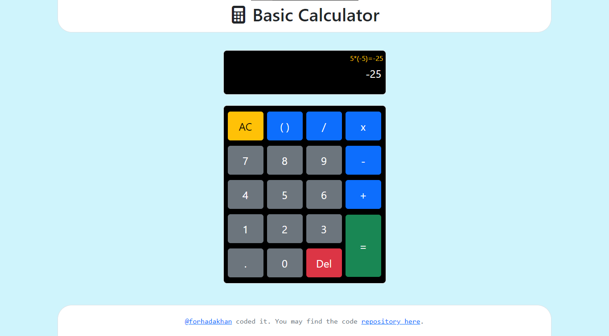

# Basic Calculator

A simple calculator web application built with Vite and React. This calculator allows you to perform basic arithmetic operations, evaluate mathematical expressions, and provides a user-friendly interface for efficient calculations.

## Features

- Addition: Perform addition operations by clicking on the "+" button or using the "+" key on your keyboard.
- Subtraction: Perform subtraction operations by clicking on the "-" button or using the "-" key on your keyboard.
- Multiplication: Perform multiplication operations by clicking on the "x" button or using the "*" key on your keyboard.
- Division: Perform division operations by clicking on the "/" button or using the "/" key on your keyboard.
- Decimal Numbers: Use decimal numbers in your calculations by clicking on the decimal point (".") button.
- Parenthesis: Group expressions using parentheses to ensure proper order of operations.
- Error Handling: The calculator provides error handling for invalid expressions and division by zero.
- Digit Limit: The calculator includes a digit limit to prevent overflowing the display with excessively long numbers.

## Live Demo

Try the calculator online: [Basic Calculator](https://forhadakhan.github.io/basic-calculator)

## Screenshots

## Installation and Usage

No installation is required to use this calculator. Simply access the live demo link mentioned above in your web browser, and you can start performing calculations right away.

## Technologies Used

- **Vite**: A fast, opinionated web dev build tool that serves as the foundation for this project.
- **React**: A JavaScript library for building user interfaces.
- **JavaScript**: The programming language used to develop the calculator logic.
- **HTML**: The markup language used for structuring the calculator's user interface.
- **CSS**: The styling language used for enhancing the visual appearance of the calculator.

## Development

If you want to explore or contribute to the development of this calculator, follow these steps:

1. Clone the repository: `git clone https://github.com/forhadakhan/basic-calculator.git`
2. Navigate to the project directory: `cd basic-calculator`
3. Install the dependencies: `npm install`
4. Start the development server: `npm run dev`
5. Open your browser and visit localhost link to see the calculator in action.

The development server uses Vite to build the project. Any changes you make to the source code will be automatically reflected in the browser without requiring a manual reload.

You can explore the project structure and modify the code in the `src` directory. The entry point for the application is `src/main.js`, and the React components can be found in the `src/components` directory.

Feel free to experiment, add new features, fix bugs, or improve the calculator's functionality. Once you're satisfied with your changes, you can submit a pull request to contribute your updates to the project.

## Feedback and Contributions

If you have any suggestions, feedback, or would like to contribute to this project, please feel free to open an issue or submit a pull request. Your contributions are highly appreciated!

## License

This project is licensed under the [MIT License](LICENSE).

